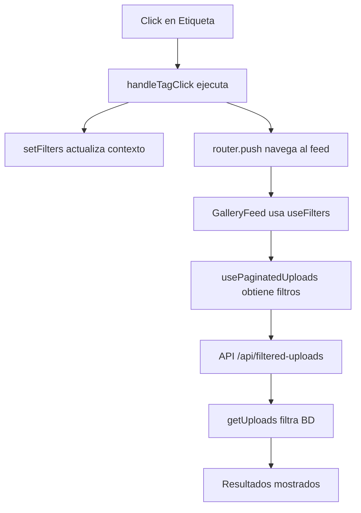

# 🏷️ Funcionalidad de Etiquetas Clickeables

## Resumen Ejecutivo

Implementamos la funcionalidad de etiquetas clickeables que permite a los usuarios hacer click en cualquier etiqueta de un upload y ser redirigidos automáticamente al feed con esa etiqueta aplicada como filtro.

## 🎯 Flujo de Usuario

1. **Usuario ve un upload** en `/feed/[id]`
2. **Ve etiquetas** como `#FPS`, `#Shooter`, `#Battle Royale`
3. **Hace click en etiqueta** (ej: `#FPS`)
4. **Es redirigido al feed** (`/feed`)
5. **Ve resultados filtrados** solo con uploads que contengan "FPS"
6. **Input de búsqueda muestra** `#FPS`

## 🔧 Implementación Técnica

### Archivo Modificado: `details-section.tsx`

**Imports Agregados:**

```typescript
import { useRouter } from "next/navigation";
import { useFilters } from "@/hooks/use-filters";
```

**Hooks Utilizados:**

```typescript
const router = useRouter();
const { setFilters } = useFilters();
```

**Función Principal:**

```typescript
const handleTagClick = (tag: string) => {
  const cleanTag = tag.trim();

  setFilters({
    searchText: `#${cleanTag}`,
    tags: [cleanTag],
    platform: undefined,
    releaseYear: undefined,
    inMyCollections: false,
    sortBy: "newest",
  });

  router.push("/feed");
};
```

**JSX Actualizado:**

```tsx
<span
  key={tag}
  onClick={() => handleTagClick(tag)}
  className="text-info-content cursor-pointer text-sm transition-colors hover:underline"
>
  #{tag.trim()}
</span>
```

## 🌊 Flujo de Datos



## 📋 Configuración de Filtros

Cuando se hace click en una etiqueta, los filtros se configuran así:

| Campo             | Valor          | Propósito                    |
| ----------------- | -------------- | ---------------------------- |
| `searchText`      | `"#etiqueta"`  | Mostrar en input de búsqueda |
| `tags`            | `["etiqueta"]` | Filtrado en backend          |
| `platform`        | `undefined`    | Limpiar filtros anteriores   |
| `releaseYear`     | `undefined`    | Limpiar filtros anteriores   |
| `inMyCollections` | `false`        | Limpiar filtros anteriores   |
| `sortBy`          | `"newest"`     | Orden por defecto            |

## 🔄 Integración con Sistema Existente

### ✅ **Funciona Con:**

- Sistema de filtros existente (`useFilters`)
- Búsqueda en tiempo real
- Paginación infinita
- API endpoints actuales
- Contexto global de filtros

### 🛡️ **Arquitectura Limpia:**

- No modifica lógica de backend
- Reutiliza infrastructure existente
- Compatible con funciones actuales
- Mantiene consistencia de UX

## 🎨 Mejoras de UX

### **Visual:**

- ✅ Cursor pointer en etiquetas
- ✅ Efecto hover con underline
- ✅ Transición suave de colores
- ✅ Mantiene estilos existentes

### **Comportamiento:**

- ✅ Navegación instantánea
- ✅ Limpia filtros anteriores
- ✅ Actualiza input de búsqueda
- ✅ Preserva funcionalidad actual

## 🧪 Casos de Uso Cubiertos

### 1. **Descubrimiento de Contenido**

```
Usuario ve upload de CS2 → Click en #FPS → Ve todos los HUDs de FPS
```

### 2. **Navegación Rápida**

```
Usuario interesado en Shooters → Click en #Shooter → Contenido relevante
```

### 3. **Filtrado Específico**

```
Usuario busca Battle Royales → Click en #Battle Royale → Solo BR HUDs
```

## ⚡ Beneficios

### **Para Usuarios:**

- 🚀 Descubrimiento más rápido de contenido
- 🎯 Navegación intuitiva por categorías
- 🔍 Filtrado instantáneo por intereses
- 📱 Funciona igual en móvil y desktop

### **Para Desarrolladores:**

- ♻️ Reutiliza infraestructura existente
- 🧹 Código limpio y mantenible
- 🔗 Integración perfecta con sistema actual
- 🛡️ No rompe funcionalidades actuales

## 🎉 Resultado Final

**Antes:** Etiquetas eran solo decorativas, sin funcionalidad
**Ahora:** Etiquetas son navegables, mejoran discovery y UX

Los usuarios pueden hacer click en cualquier etiqueta y ser llevados instantáneamente a contenido relacionado, mejorando significativamente la navegación y descubrimiento de contenido en la plataforma.
